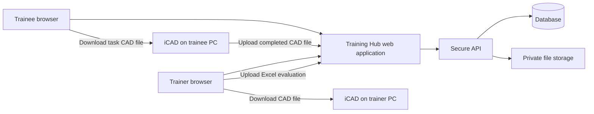

# KMTI Training Hub: Browser-Based Platform Implementation Plan

## 1. Purpose and outcome

Transform KMTI Training Hub from its current desktop-assisted application into a secure browser-based learning platform that can be accessed by trainees in Japan and other external locations.

The platform will help students and employees learn iCAD through manuals, guided lessons, quizzes, practical CAD tasks, file submission, and trainer feedback.

### Success criteria

- A trainee can use Training Hub in a modern browser without installing Training Hub itself.
- A trainee can enroll in lessons, track progress, download task files, submit completed CAD work, and receive feedback.
- A trainer can assign work, download CAD submissions for local iCAD review, upload an Excel evaluation sheet, and approve or return work for revision.
- An administrator can manage users, courses, assignments, and content.
- The service is secure, backed up, monitored, and deployable outside the company network.

## 2. Confirmed scope

### Included

- iCAD manuals and lesson content
- Japanese and English user interface and lesson content
- Text-to-speech, images, videos, and learning progress
- Trainee, trainer, and administrator accounts
- Quizzes and practical CAD assignments
- CAD task-file download and completed-file upload
- Trainer review, feedback, approval, and revision requests
- Excel evaluation sheets uploaded by trainers as the official checkback document
- Notifications, audit trail, progress reporting, and course completion records

### Excluded

- Quotation training
- Quotation entry workspace
- Quotation print, PDF, Excel export, and quotation submission workflow
- Running iCAD inside the browser
- Opening local iCAD directly from a public browser session

## 3. Product model

Training Hub will be a web learning portal. iCAD remains a separately installed desktop application.

The browser platform manages learning and submissions. iCAD work is performed locally by the trainee and trainer where iCAD is installed.

## 4. User roles and journeys

### Trainee

1. Receives an invitation or creates an approved account.
2. Signs in through a browser and selects an assigned course.
3. Completes lessons, quizzes, and guided learning steps.
4. Downloads the required CAD source/reference files.
5. Opens the files in locally installed iCAD and completes the task.
6. Uploads the completed CAD file or files.
7. Monitors the submission status.
8. Downloads the trainer's Excel evaluation sheet and reads feedback.
9. Revises and resubmits when requested.

### Trainer

1. Creates or assigns a course and practical task.
2. Monitors trainee progress and pending submissions.
3. Downloads a trainee CAD submission.
4. Reviews it locally in iCAD.
5. Completes the standard Excel evaluation sheet.
6. Uploads the evaluation sheet and adds optional in-app feedback.
7. Marks the submission as approved or requires revision.

### Administrator

1. Manages users, roles, courses, lesson publication, and trainer assignments.
2. Maintains standard evaluation-sheet templates.
3. Reviews service health, storage usage, audit records, and reports.

## 5. Browser-conversion architecture

### Frontend

- Build the existing React frontend as a standard web application.
- Use browser-safe routing and environment-driven API configuration.
- Remove native title-bar controls from browser mode.
- Remove Electron-only resizing and application-close behavior from browser mode.
- Show browser-safe alternatives where desktop functions previously appeared.

### Backend API

- Keep the API as the sole authority for authentication, roles, progress, assignments, submissions, feedback, and status changes.
- Version public API endpoints and validate every request on the server.
- Configure production API URLs through environment variables; never ship `localhost`, `127.0.0.1`, or internal LAN IP addresses in public builds.

### Database

- Use managed MySQL for production data.
- Separate production, staging, and development databases.
- Run tested migrations before each release.
- Back up daily and regularly test restore procedures.

### File storage

- Move CAD, Excel, image, and video files from local server folders to private object storage.
- Use signed upload/download links with expiration.
- Store file metadata in the database: owner, task, version, type, size, checksum, upload time, and status.
- Preserve submission versions; never overwrite prior trainee or trainer files.

## 6. Desktop-only feature replacement

| Current desktop behavior | Browser replacement |
|---|---|
| Window minimize/maximize/close | Do not show native window controls in browser mode |
| Electron server configuration | Use deployment environment configuration only |
| Launch iCAD directly | Download file and show “Open in iCAD” instructions |
| Detect local iCAD installation | Show system requirements and troubleshooting guidance |
| Open local Excel file | Download the trainer evaluation workbook |
| Desktop notifications | Browser notifications where permission is granted; in-app notices as the default |

Implement a platform service so components request a capability rather than directly using `window.electronAPI`. The service will provide a desktop implementation for internal desktop use and a browser implementation for public access.

## 7. Practical assessment and Excel checkback

### Assessment record

Each practical assessment should contain:

- Task title, description, course, due date, and instructions
- Downloadable source/reference CAD files
- Allowed submission types and maximum file size
- Trainee submission version history
- Status: Draft, Submitted, Under Review, For Revision, Approved
- Trainer score, remarks, approval date, and reviewer identity
- Uploaded Excel evaluation sheet

### Excel evaluation workflow

1. Trainer downloads the trainee CAD file.
2. Trainer checks the work in local iCAD.
3. Trainer fills in the standardized Excel evaluation sheet.
4. Trainer uploads the completed workbook to the assessment record.
5. Trainee sees the new status and downloads the Excel file.
6. If revision is required, the trainee uploads a new CAD version without deleting the previous version.

The Excel workbook remains the official detailed checkback format. In-app scores and comments give trainees a quick status without replacing the spreadsheet.

## 8. Security and access control

Before public access, implement and verify:

- HTTPS on every public endpoint
- Domain-restricted CORS configuration
- Secure session/token handling with expiration and refresh strategy
- Password reset, email verification, and account invitation workflow
- Backend-enforced role-based access control
- Rate limiting for sign-in, reset, upload, and download endpoints
- File type, file size, and malware scanning controls
- Private file storage; files must not be publicly enumerable
- Audit logging for login, upload, download, scoring, approval, and role changes
- Error monitoring without exposing sensitive internal details

Because trainees are expected to be in Japan, complete a formal privacy, retention, and cross-border data review with the company’s legal or compliance owner before launch. Do not treat this plan as legal advice.

## 9. Content and localization

- Keep Japanese as a first-class language, not an automatic browser translation.
- Store all live user-facing text in translation dictionaries or structured lesson content.
- Preserve technical iCAD screenshots as source material where translation would alter the reference UI.
- Translate surrounding lesson explanations, navigation, captions, warnings, tables, and trainer feedback templates.
- Add content states: Draft, Under Review, Published, Archived.
- Give administrators a controlled way to revise lessons without changing application code for every text correction.

## 10. Japanese user readiness

- Use Japan Standard Time for all trainee- and trainer-facing timestamps.
- Display dates in a locale-appropriate format while retaining UTC internally.
- Use Japanese fonts that support technical text and mixed Japanese/English terminology.
- Provide Japanese system requirements, upload guidance, password-reset messages, and support contact details.
- Test on networks with high latency and on common browsers used by the intended clients.

## 11. Deployment environments

| Environment | Purpose |
|---|---|
| Development | Local development and automated tests |
| Staging | Production-like testing, trainer acceptance testing, migration rehearsal |
| Production | Public trainee and trainer service |

Each environment must have separate API settings, database, storage bucket/container, credentials, and monitoring configuration.

## 12. Delivery phases

### Phase 0: scope and readiness

- Remove Quotation functionality from navigation, routes, APIs, and documentation where it remains.
- Confirm user roles, task lifecycle, file types, retention rules, and Excel evaluation template.
- Identify all Electron-only code paths and browser replacements.

**Exit condition:** Approved browser product scope and technical inventory.

### Phase 1: browser foundation

- Create environment-based configuration for API and web URLs.
- Introduce platform abstraction for desktop-only capabilities.
- Hide native controls and local-server configuration in browser mode.
- Implement user-friendly browser fallbacks for iCAD and Excel actions.
- Establish staging frontend, API, database, and storage.

**Exit condition:** A browser can log in and use core training content without Electron.

### Phase 2: secure file and assessment workflow

- Implement managed object storage and signed uploads/downloads.
- Create task assignment, CAD submission versioning, and status transitions.
- Implement trainer review queue and Excel evaluation-sheet upload.
- Add trainee feedback, revision, and resubmission views.

**Exit condition:** A full trainee-to-trainer CAD review cycle works through the browser.

### Phase 3: course and trainer operations

- Add trainee and trainer dashboards.
- Add course assignment, due dates, progress monitoring, and notifications.
- Add rubrics, scores, approval decisions, and reports.
- Add administrator management for users, roles, content, and templates.

**Exit condition:** Trainers can manage a real class without manual database or file-server work.

### Phase 4: production hardening

- Complete security review, privacy review, backups, restore test, load test, and accessibility test.
- Complete Japanese-language review by a qualified reviewer.
- Configure operational monitoring, alerts, audit logs, and support procedures.
- Run a pilot with a small trainee group before wider release.

**Exit condition:** Release approval based on a documented production-readiness checklist.

### Phase 5: future enhancements

- Course certificates and completion reports
- Email notifications and scheduled reminders
- Better trainer analytics and trainee performance trends
- Optional browser CAD preview/conversion research
- Guided onboarding and knowledge-base support

## 13. Testing and release gates

### Functional testing

- Sign up/in/out, invitation, reset password, role permissions
- Course assignment, lesson completion, quiz scoring, and progress persistence
- CAD download, upload, resubmission, download authorization, and version history
- Excel evaluation upload, download, and trainee visibility
- Trainer approval and revision workflows

### Quality testing

- Chrome, Edge, Firefox, and Safari testing
- Desktop, laptop, and tablet responsive testing
- Keyboard navigation, focus states, contrast, and image alternative text
- Japanese text layout, timestamps, and mixed technical terminology
- Slow network, interrupted upload, and large-file behavior

### Security and operations testing

- Unauthorized access attempts and role-boundary checks
- Expired session, expired signed URL, and deleted-account behavior
- Upload validation and malware scanning path
- Database restore and file-storage recovery test
- Monitoring alert simulation and incident response drill

## 14. Initial pilot definition

The first public pilot should include:

- Browser sign-in and Japanese/English interface
- 2D Drawing lessons and existing TTS content
- One complete practical CAD assessment
- Source CAD download and completed CAD upload
- Trainer local iCAD review
- Excel evaluation-sheet upload and trainee download
- Approval/revision cycle
- Basic progress and submission dashboards

Do not include broad public self-registration, advanced CAD preview, certificates, or all curricula until the pilot workflow is stable.

## 15. Immediate next actions

### Progress update — 30 July 2026

- Completed: native desktop window controls are hidden in the browser experience.
- Completed: trainee task actions use a direct CAD download in a browser; the desktop-only “Open in iJCAD” action remains available only in the desktop application.
- Completed: unreachable frontend quotation hooks, API wrapper, utilities, types, and translation bundles were removed.
- Preserved: historical assessment rows and their backend quotation references, so past records remain intact during the transition.

1. Confirm the standard Excel evaluation template and scoring rubric.
2. Create an inventory of Electron-only features and determine the browser replacement for each.
3. Remove all remaining Quotation routes, navigation, API calls, assets, and tests.
4. Configure a staging domain, HTTPS, managed database, and private file storage.
5. Implement the platform service and production environment configuration.
6. Build and test the trainee CAD submission and trainer Excel-feedback cycle.
7. Run a trainer-and-trainee pilot before public release.
