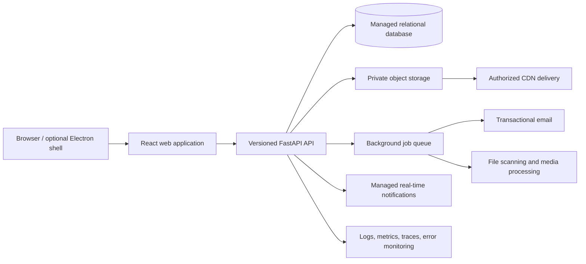

# KMTI Training Hub: Online Course Platform Implementation Plan

**Branch reviewed:** `mg-ui-enhance`  
**Review date:** 2026-08-17  
**Objective:** Evolve the current browser-capable iCAD training application into a secure, maintainable online course and training platform for trainees, trainers, content managers, and administrators.

## 1. Executive recommendation

Do not rewrite the platform. Preserve the existing bilingual lesson library, quizzes, practical CAD task workflow, trainer feedback, notifications, analytics, and role-based interfaces. Build a proper learning-management domain around them, move browser deployments away from local/Electron assumptions, and harden authentication, storage, migrations, testing, and operations.

The recommended release sequence is:

1. Stabilize the web foundation and security.
2. Add organizations, cohorts, enrollment, assignments, and durable completion tracking.
3. Make the complete trainee-to-trainer assessment workflow browser-native.
4. Move lesson content into a versioned authoring and publishing system.
5. Add reporting, certificates, communications, and production operations.

The first public release should target company-managed training, not a public marketplace. Payments, public course sales, multi-vendor authoring, and live browser CAD are deliberately outside the initial scope.

## 2. Review scope and current architecture

The review covered the application structure, frontend routes and role views, reusable components and hooks, API services, authentication, WebSocket notifications, backend routers and services, SQLAlchemy models and schemas, Alembic setup, practical-assessment file handling, automated tests, build configuration, Electron integration, deployment documentation, and prior QA/readiness reports. Large lesson files and media assets were inventoried as content; repeated instructional markup was assessed through its shared patterns rather than treating every image or CAD binary as executable code.

### Current stack

| Area | Current implementation |
|---|---|
| Frontend | React 18, TypeScript, Vite, React Router, Axios, Socket.IO/WebSocket, bilingual dictionaries |
| Desktop wrapper | Electron remains supported and contains native download/open and window-management behavior |
| Backend | FastAPI, SQLAlchemy, Pydantic, JWT bearer authentication |
| Data | MySQL with SQLite fallback; runtime table creation plus a largely unused Alembic setup |
| Files | Local/NAS filesystem paths for CAD submissions, task files, feedback workbooks, knowledge sources, and TTS cache |
| Learning features | Courses, hierarchical lessons, bilingual lesson content, quizzes, scores, progress, practical tasks, submissions, trainer feedback, announcements, and notifications |
| Roles | `trainee`, `employee`, and `admin`; employee functions as trainer/mentor |
| Tests | Useful auth, RBAC, quiz, assessment, CORS, frontend service, login, and utility coverage, but limited end-to-end workflow coverage |

### Current user workflow

**Trainee**

1. Signs in and enters Mentor Mode.
2. Selects 2D/3D instructional or practical content.
3. Reads bilingual lessons, uses TTS/media, and takes lesson quizzes.
4. Downloads practical source files and completes work in local CAD software.
5. Uploads a submission, tracks its status, reads trainer feedback, downloads an Excel checkback, and may reply or submit again.

**Trainer/employee**

1. Signs in to assistant/mentor tools.
2. Sees assigned trainees and their progress/activity.
3. Reviews pending practical submissions and downloads CAD files.
4. Uploads a checkback workbook, writes comments, and approves or rejects the submission.
5. Uses notifications and trainee telemetry to monitor activity.

**Administrator**

1. Manages users and trainer-trainee mappings.
2. Manages practical tasks, quizzes, curriculum blocks, knowledge-base files, announcements, and settings.
3. Views system analytics, audit-style logs, progress details, and exports.

## 3. What should be retained

- The bilingual English/Japanese experience and translation structure.
- Existing 2D and 3D course material, screenshots, videos, interactive maps, TTS, and AI support.
- Quiz definitions, question analytics, best-score history, and detailed attempts.
- The CAD download, local completion, upload, trainer review, Excel checkback, feedback, and resubmission concept.
- Trainer-to-trainee assignment and real-time notification foundations.
- Admin user, curriculum, assessment, broadcast, analytics, and knowledge-management interfaces.
- Electron as an optional internal client, provided the web application becomes the primary platform and desktop capabilities are isolated behind an adapter.

## 4. Principal gaps and risks

### Product/domain gaps

- A `Course` is currently a content category, not an offered course with owner, schedule, enrollment, visibility, prerequisites, completion rules, or lifecycle.
- There are no enrollment, organization, cohort/class, course-run, instructor assignment, or learner invitation records.
- Trainer-trainee mapping is global rather than scoped to a class/course offering.
- Practical tasks are set-based and globally visible; they are not formal course assignments with due dates, availability windows, attempt rules, rubrics, or gradebook entries.
- Progress is split across coarse `UserProgress`, `QuizScore`, lesson UI state, and assessment calculations. There is no authoritative lesson-attempt/completion event model.
- Certificates are suggested in UI text but are not a secure, verifiable credential workflow.
- No discussion, support ticket, calendar/session, or structured learner onboarding workflow exists.

### Architecture and maintainability gaps

- Several frontend files exceed 1,000 lines, notably practical dashboards and content components. State, API orchestration, business rules, and rendering are often mixed.
- Lesson content is partly database-driven but much of it remains compiled into large TSX files and constants. Content updates therefore require engineering releases.
- Backend routers, especially assessments, contain substantial business and filesystem logic that should live in services/repositories.
- The frontend has duplicate Axios/auth handling and event-bus-style global browser events. Cache invalidation clears all GET data after most mutations.
- Desktop and browser behavior is detected directly through `window.electronAPI` in hooks/components instead of a single platform capability layer.
- WebSocket URL construction includes a fixed port fallback and does not consistently derive from the configured API URL.
- The API surface is nominally `/api/v1`, but conventions, pagination, errors, filtering, idempotency, and documentation are inconsistent.

### Security and online-readiness gaps

- Access tokens are stored in `sessionStorage`; there is no refresh-token rotation, server-side revocation/session inventory, or multi-device session management.
- Registration appears open to trainee/employee accounts. A company training platform should default to invitation or admin-approved enrollment.
- Forgot-password currently behaves as an administrator notification/request, not a signed, expiring email reset flow.
- No email verification, MFA option for privileged roles, login rate limiting, lockout policy, or bot protection is evident.
- File controls are based primarily on names/extensions and filesystem containment. Public operation also requires size limits, MIME/signature verification, malware scanning, quotas, checksums, and private authorization on every download.
- Local/NAS path persistence prevents horizontal scaling and creates backup/recovery and cross-environment portability risk.
- Debug/admin endpoints, runtime schema mutation, permissive development fallbacks, and detailed errors must be disabled or controlled in production.
- Audit logs are not yet a tamper-resistant, structured record of security and learning-administration actions.

### Data and operations gaps

- Runtime `create_all` and inline `ALTER TABLE` operations coexist with only one minimal Alembic migration. This is unsafe for controlled production releases.
- SQLite automatic fallback can allow production writes to diverge silently from MySQL. Production should fail closed, while offline/local mode should be explicitly separate.
- There is no demonstrated object-storage lifecycle, background job system, email delivery pipeline, observability stack, restore drill, disaster recovery objective, or capacity plan.
- Automated coverage is valuable but narrow relative to the size of the system. There are no full browser journeys for enrollment through completion and trainer grading.
- Static media and very large lesson bundles need CDN delivery, caching, lazy loading, and performance budgets.

## 5. Target product model

Introduce the following core entities while retaining the existing curriculum entities:

| Entity | Purpose |
|---|---|
| `Organization` | Tenant/company boundary, branding, locale, policy, and data ownership |
| `Membership` | A user's role within an organization; supports future multi-role users |
| `Course` | Reusable course definition, description, outcomes, category, language, owner, and status |
| `CourseVersion` | Immutable published snapshot of modules, lessons, assessments, and completion rules |
| `Module` | Ordered grouping within a course |
| `Lesson` / `ContentBlock` | Versioned learning content with text, media, downloads, embeds, and accessibility metadata |
| `CourseRun` | A scheduled offering of a course version with dates, instructors, capacity, and timezone |
| `Cohort` | Learner group within an organization or course run |
| `Enrollment` | Learner access and lifecycle: invited, active, completed, withdrawn, expired |
| `Assignment` | Quiz or practical work with availability, due date, attempts, rubric, and completion weight |
| `LearningAttempt` | A durable attempt at a lesson, quiz, or assignment |
| `CompletionEvent` | Append-only evidence of started, viewed, passed, submitted, graded, or completed activity |
| `GradeItem` / `Grade` | Normalized gradebook record with scorer, rubric, score, and feedback |
| `SubmissionVersion` | Immutable uploaded-file version and status transition history |
| `FileObject` | Storage key, owner, purpose, MIME, size, checksum, scan state, and retention metadata |
| `Certificate` | Completion credential with public verification ID and revocation state |
| `NotificationPreference` | In-app/email preferences, locale, digest, and quiet hours |
| `AuditEvent` | Structured actor, action, target, timestamp, IP/device context, and result |

Existing `Course`, `Lesson`, `LessonContent`, `Quiz`, `AssessmentTask`, and submission records should be migrated incrementally into this model. Do not perform a one-time destructive conversion.

## 6. Target architecture

Architectural rules:

- The API is the authority for identity, authorization, enrollment, progress, grading, file access, and status changes.
- Browser and Electron clients consume the same API. A `PlatformCapabilities` interface owns download/open, notifications, and window-specific behavior.
- Use explicit service and repository layers for course, enrollment, progress, assessment, storage, notification, and reporting domains.
- Store timestamps in UTC and render in the user's/organization's timezone, with Asia/Tokyo and Asia/Manila treated as first-class deployment cases.
- Use private object storage. Database records hold metadata and storage keys, never public permanent URLs or machine-specific absolute paths.
- Long work such as scans, email, exports, media processing, AI indexing, and certificate generation runs asynchronously with retries and dead-letter handling.

## 7. Implementation roadmap

### Phase 0 — Product rules and baseline (1–2 weeks)

**Work**

- Confirm launch model: internal/company invitation only, target organizations, expected users, languages, browsers, file types/sizes, retention, and support ownership.
- Define roles as permissions: learner, instructor, content editor, organization admin, platform admin. Map current `trainee`, `employee`, and `admin` roles temporarily.
- Define course completion rules, quiz passing policy, practical status transitions, late work, resubmission, grading, and certificate eligibility.
- Capture three baseline journeys as executable acceptance specifications: learner completion, instructor grading, and admin course launch.
- Inventory compiled TSX lessons and map them to a normalized content schema.
- Freeze and document the current database schema and file roots; create a migration rehearsal copy.

**Exit criteria**

- Approved domain glossary, role/permission matrix, workflow state diagrams, data retention decision, and measurable pilot success criteria.

### Phase 1 — Web foundation, identity, and release safety (3–5 weeks)

**Backend**

- Make Alembic the only schema-change mechanism. Create a baseline migration for every modeled table, then remove production runtime DDL.
- Disable implicit SQLite failover in hosted environments; retain SQLite only as an explicit development/offline profile.
- Add environment validation at startup and fail closed when production secrets, database, storage, CORS, or public URLs are invalid.
- Implement invitation-based activation, expiring password reset, verified email, refresh-token rotation, logout/revocation, login throttling, and session/device records.
- Introduce permission checks independent of string comparisons and add organization scoping to every relevant query.
- Standardize API errors, request IDs, pagination, filtering, sorting, idempotency for uploads/submissions, and OpenAPI descriptions.

**Frontend**

- Consolidate Axios clients into one API client with typed domain services and consistent auth-expiry handling.
- Add a browser/Electron capability adapter and remove direct `window.electronAPI` checks from feature hooks.
- Derive HTTP, Socket.IO, and WebSocket endpoints from validated environment configuration.
- Use protected route guards by permission, not only conditional navigation.
- Split the largest views into feature modules, hooks, and presentational components; introduce a server-state library or a consistent query/cache layer.
- Add a responsive application shell, skip links, focus handling, keyboard navigation, semantic headings, captions/transcripts, and WCAG 2.2 AA checks.

**Quality/operations**

- Add CI gates for typecheck, lint, unit/integration tests, production web build, migration upgrade/downgrade rehearsal, dependency/security scan, secret scan, and container/image scan.
- Add Playwright browser tests for sign-in, permission denial, session expiry, language switching, and logout.

**Exit criteria**

- A staged HTTPS browser deployment operates without Electron; identity recovery works through email; migrations are repeatable; no hosted request silently falls back to a local database.

### Phase 2 — LMS core: course runs, cohorts, enrollment, and progress (4–6 weeks)

**Work**

- Add organization, membership, course version, course run, cohort, instructor assignment, and enrollment models/APIs.
- Create admin workflows for inviting learners, bulk CSV enrollment, assigning instructors, scheduling runs, and opening/closing enrollment.
- Replace global trainer-trainee mapping with course-run-scoped instructor/learner access while maintaining a compatibility view during migration.
- Introduce modules, prerequisites, availability rules, required/optional lessons, estimated duration, and completion rules.
- Replace percentage calculations with append-only completion events and a projection that calculates learner/course progress deterministically.
- Add learner dashboard: enrolled courses, continue learning, deadlines, recent feedback, completion percentage, and activity history.
- Add instructor dashboard: course runs, roster, at-risk learners, grading queue, upcoming due dates, and announcements.
- Add an admin course-run wizard and roster import validation report.

**Migration**

- Create one legacy organization and course runs for existing course categories.
- Convert existing users to memberships, trainer mappings to instructor/cohort assignments, and quiz/progress records to legacy-tagged completion evidence.
- Reconcile totals before switching reads; retain rollback views until two successful releases.

**Exit criteria**

- An admin can create a scheduled course run, enroll a cohort, assign an instructor, and observe accurate per-learner completion without manual database work.

### Phase 3 — Browser-native assignments, grading, and file lifecycle (4–6 weeks)

**Work**

- Model practical tasks as course assignments with availability, due date, timezone, allowed extensions, file/attempt limits, rubric, weight, and late policy.
- Add immutable submission versions and explicit transitions: draft, submitted, under review, changes requested, resubmitted, approved, and archived.
- Store task, submission, and checkback files in private object storage using short-lived signed upload/download operations.
- Verify filename, size, declared MIME, binary signature, checksum, ownership, course enrollment, and authorization. Quarantine until malware scanning succeeds.
- Make grading idempotent and transactional. Record reviewer, rubric values, comments, workbook version, decision, and audit event.
- Prevent learners from deleting submitted evidence; allow withdrawal before review and policy-driven archival. Admin purge must require elevated permission and retention checks.
- Add resumable/multipart uploads for large CAD packages, visible progress, retry, cancellation, and safe duplicate handling.
- Add email and in-app notifications for assignment release, approaching due date, submission receipt, changes requested, and approval.

**Exit criteria**

- A complete CAD assignment cycle works from an external browser, every file is private and versioned, and a learner cannot access another learner's file by changing an identifier.

### Phase 4 — Course authoring and publishing (5–8 weeks)

**Work**

- Define a structured content-block schema: rich text, callout, image, gallery, video, transcript, download, table, quiz embed, interactive image, 3D viewer, and knowledge check.
- Build editor preview, autosave draft, validation, revision history, review request, approval, publish, schedule, archive, and rollback.
- Publish immutable course versions so active learners are not disrupted by edits.
- Migrate hard-coded TSX lesson content in batches, beginning with a representative 2D and 3D module. Retain custom renderers for interactive lessons.
- Move translations alongside content versions with completeness status and reviewer approval. Add fallback and missing-key reporting.
- Store media metadata, alt text, captions, transcripts, poster image, duration, locale, and rights/source information.
- Optimize delivery through code splitting, lazy media, responsive images, streaming/range support, cache headers, and a CDN.

**Exit criteria**

- A content editor can revise and publish a bilingual lesson without a code deployment, while enrolled learners remain pinned to the appropriate published course version.

### Phase 5 — Gradebook, credentials, communications, and analytics (4–6 weeks)

**Work**

- Add a unified gradebook for quizzes and practical work, weighted categories, overrides with reason, exports, and learner-visible calculation details.
- Generate signed certificates only from server-confirmed completion. Include unique verification URL/QR, issue date, course version, recipient, and revocation state.
- Add scheduled announcements, targeted cohort messaging, email templates by locale, delivery status, preference management, and digest options.
- Add learner engagement and outcome dashboards: enrollment, start, completion, time-to-complete, assessment attempts, question difficulty, overdue work, and inactivity risk.
- Define event names and metric ownership before instrumenting. Exclude lesson text, passwords, CAD contents, tokens, and sensitive feedback from analytics payloads.
- Provide support/contact and issue-reporting flows with consented diagnostic context.

**Exit criteria**

- Instructors can operate from roster to gradebook; learners receive a verifiable completion credential; admins can measure outcomes without exposing sensitive content.

### Phase 6 — Production hardening and pilot (3–5 weeks)

**Work**

- Add structured logs, metrics, traces, error monitoring, uptime checks, storage/queue dashboards, and alerts with documented owners.
- Define and test backup, point-in-time database recovery, object versioning, restore procedures, RPO/RTO, key rotation, and incident response.
- Run penetration testing, dependency review, authorization matrix tests, file-upload abuse tests, and privacy/security assessment.
- Load-test authentication, course access, video delivery, quiz submission, uploads, grading queues, notifications, and exports at expected peak concurrency.
- Complete WCAG audit, Japanese content review, mobile/tablet testing, high-latency testing, and supported-browser matrix.
- Pilot with one small cohort. Track activation, lesson completion, upload success, grading turnaround, support requests, and user satisfaction.

**Exit criteria**

- Production go-live checklist is signed by product, training, security/privacy, operations, and support owners; restore and rollback evidence is attached to the release.

## 8. Recommended frontend refactoring order

1. Create feature boundaries: `auth`, `courses`, `enrollments`, `learning`, `assessments`, `gradebook`, `notifications`, `admin`, and `platform`.
2. Consolidate API/auth configuration and generated/shared request/response types.
3. Extract practical dashboard state and mutations from the current very large trainer/assessment components.
4. Replace window event strings with typed query invalidation or a small typed event layer only for true cross-feature events.
5. Introduce shared lesson primitives, then migrate repeated 2D/3D layout, navigation, tabs, TTS, and media behavior.
6. Add route-level lazy loading and media performance budgets.
7. Create an accessible design-system layer for buttons, forms, dialogs, tables, status badges, empty/error states, pagination, and file upload.

## 9. Recommended backend refactoring order

1. Establish configuration profiles and Alembic baseline.
2. Introduce repositories/unit-of-work for identity, courses, enrollment, progress, assessments, storage, and notifications.
3. Break `routers/assessments.py` into task, submission, grading, file, and instructor-roster modules.
4. Move status rules into domain services and enforce transitions centrally.
5. Add organization/course-run authorization policies and reusable object-level permission tests.
6. Replace direct filesystem paths with a storage interface, initially backed by the existing filesystem and later by object storage.
7. Add background jobs and transactional outbox delivery for email/notifications so database changes and messages cannot drift.
8. Add read models/materialized summaries for dashboards instead of repeatedly calculating broad progress in request handlers.

## 10. Testing strategy

### Required test layers

- **Domain unit tests:** completion rules, enrollment states, due dates/timezones, grade calculation, submission transitions, and permission policies.
- **API integration tests:** every endpoint across organization, role, ownership, invalid state, pagination, and idempotent retries.
- **Storage security tests:** traversal, disguised extensions, oversized files, checksum mismatch, quarantined files, expired signed links, and cross-user access.
- **Migration tests:** production-like schema upgrade, data reconciliation, downgrade/rollback where supported, and repeatability.
- **Browser journeys:** invite/activate, enroll/start/continue, pass/fail/retry quiz, upload/resubmit, grade/request changes, completion/certificate, and bilingual navigation.
- **Accessibility tests:** automated checks plus keyboard and screen-reader manual scenarios.
- **Performance tests:** first load, lesson navigation, concurrent quiz submission, large uploads, dashboard queries, and notification fan-out.

### Minimum release gates

- No critical/high known vulnerabilities without documented owner and time-bounded acceptance.
- Zero TypeScript and migration errors.
- Permission matrix and cross-tenant isolation suites pass.
- Core browser journeys pass against a production-like environment.
- Backup restore and previous-release rollback have recent evidence.
- Performance and accessibility budgets meet the approved thresholds.

## 11. Suggested initial backlog (first 10 deliverable slices)

1. Production configuration validation and explicit database profiles.
2. Complete Alembic baseline and remove runtime production DDL.
3. Unified web API client and platform capability adapter.
4. Invitation, email verification, password reset, refresh sessions, and throttling.
5. Organization and permission model with legacy-role compatibility.
6. Course run, cohort, enrollment, and instructor assignment APIs/UI.
7. Durable completion events and learner “Continue learning” dashboard.
8. Storage abstraction plus private object-storage proof of concept.
9. Versioned practical submission and grading state machine.
10. One representative hard-coded lesson migrated into the draft/review/publish content pipeline.

Current progress on slice 6: `[x]` Course-run, cohort, enrollment, and instructor-assignment models, protected APIs, Organization Admin UI, audit events, role validation, and automated tests are complete for the single-company platform.

Current progress on slice 10: `[~]` The course-level draft → review → publish → archive workflow, permission boundary, learner visibility filter, audit trail, automated tests, and Curriculum Admin UI are complete. Versioned lesson authoring and migration of a representative hard-coded lesson remain.

Each slice should include schema migration, API, UI, authorization, audit event, tests, telemetry, user documentation, and rollback notes rather than delivering backend and frontend in isolated long-running branches.

## 12. Success metrics for the pilot

- At least 95% of invited pilot users activate without administrator intervention.
- At least 90% can start and resume a course successfully on a supported browser.
- At least 95% of valid CAD uploads complete without support assistance.
- Zero cross-user or cross-organization data-access failures.
- Median trainer grading turnaround is visible and meets the training team's target.
- Progress and gradebook reconciliation has no unexplained discrepancies.
- Backup restoration meets approved RPO/RTO.
- Accessibility has no critical WCAG 2.2 AA defects in core journeys.
- Japanese and English content completeness is 100% for the pilot course.

## 13. Decisions needed before implementation

- Is the platform single-company initially, or must multiple client companies be isolated at launch?
- Will users be invitation-only, synchronized from an HR directory, or both?
- Which email provider and sender domain will be used?
- What CAD formats, maximum sizes, retention period, and malware-scanning SLA are required?
- Must current Electron/offline use continue, and if so, which features must work without a network?
- What defines course completion and certificate eligibility for each course?
- Who may author, review, translate, and publish training content?
- What are the expected pilot and first-year concurrent-user and storage volumes?
- Which privacy jurisdictions and company policies govern Philippine and Japanese learner data?

## 14. Definition of the first real online-course release

The platform can be called a real online course/training platform when an administrator can publish a versioned course offering, invite and enroll a cohort, assign an instructor, and set dates; a learner can activate an account, complete structured lessons and assessments, resume on another device, submit versioned CAD work, receive feedback, and complete the course; and an instructor can manage the roster, grading queue, feedback, and gradebook. All of this must work in a standard browser over HTTPS with private files, durable audit/history records, tested backups, monitored services, and no dependence on a local Training Hub installation.
